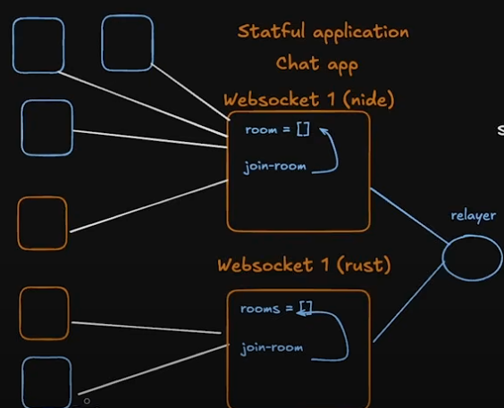

### Example Scalable Websocket relay server to dispatch and sync messages across multiple websocket servers

### Phase 2 - More common, use a PUB/SUB instead of secondary websocket server as relay service
